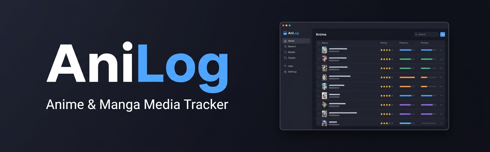

<p align="center">
  
</p>
<p align="center">
  <strong>A fast, native desktop tracker for your anime &amp; manga - built in modern C++.</strong>
</p>
<p align="center">
  <a href="#download-windows-exe">Download EXE</a> &nbsp;&bull;&nbsp;
  <a href="#-windows-setup">Setup</a> &nbsp;&bull;&nbsp;
  <a href="#-key-features">Features</a> &nbsp;&bull;&nbsp;
  <a href="#-project-structure">Structure</a>
</p>

## 📖 About AniLog

AniLog is a **native desktop application** for keeping track of the anime you are
watching and the manga you are reading. Instead of relying on a website or a
cloud account, AniLog stores everything **locally on your own machine** in plain
text files - your library, your progress, your ratings, and a full activity log.

It is built as a learning-focused but genuinely usable C++ project: a clean,
multi-file codebase rendered with an immediate-mode GUI. You log in, add titles,
update your progress as you watch or read, and watch your stats fill in over
time - all in a snappy desktop window with no internet required.

> **Status:** Active development. The app is fully usable; UI details and
> features may still evolve.

## ⚙️ Tech Stack

<p align="center">
  
  
  
  
  
  
</p>

<p align="center"><sub>Built in modern C++ with an immediate-mode Dear ImGui interface, GLFW windowing, OpenGL rendering, a CMake build, and 100% local plain-text storage (no database, no cloud).</sub></p>

## 🌟 Key Features

- **Local accounts** - sign up and log in; each user gets their own private library and logs.
- **Track anime &amp; manga** - store title, type, current/total progress, a 1-5 star rating, and status.
- **AniDex library view** - browse your collection split into **Active**, **Completed**, and **Dropped** tables.
- **Quick progress** - bump episodes/chapters with a single `+1` button; titles auto-complete when they hit their total.
- **Add / Edit form** - one consistent form for creating and editing records, with live validation (no blank or duplicate titles).
- **Search &amp; filter** - find titles by name and filter by media type, with one-click sorting (A-Z, Z-A, rating, progress).
- **Rewatch / Reread &amp; Resume** - restart completed titles or pick dropped ones back up.
- **Statistics tab** - live totals and progress metrics presented as clean tables.
- **Activity log** - a timestamped history of everything you do, grouped by date, newest first.
- **Built-in Help tab** - getting-started notes, tips, and common fixes inside the app.
- **100% offline** - your data never leaves your computer.

## 📁 Project Structure

```text
AniLog.cpp/
|-- .github/workflows/
|   `-- build-windows-exe.yml    # GitHub Actions build and release artifact upload
|-- include/imgui/               # Vendored Dear ImGui source files
|-- resources/
|   |-- anilog.ico               # Windows executable icon embedded by CMake
|   |-- anilog-icon.png          # PNG source/preview for the AniLog icon
|   `-- anilog.rc                # Windows resource file for AniLog.exe
|-- src/
|   |-- main.cpp                 # Window setup, render loop, sidebar, login/signup
|   |-- anilog_globals.h         # Shared fonts, colors, structs, enums, declarations
|   |-- anilog_utils.cpp         # Global definitions, file I/O, auth, sorting helpers
|   |-- anilog_library.cpp       # TAB 1: AniDex library tables
|   |-- anilog_add_edit.cpp      # TAB 2: Add / Edit record form
|   |-- anilog_statistics.cpp    # TAB 3: Statistics totals and progress metrics
|   |-- anilog_activity_log.cpp  # TAB 4: Activity log
|   `-- anilog_help.cpp          # TAB 5: Help guide
|-- CMakeLists.txt               # Builds the app target as AniLog.exe
|-- image.png                    # README banner image
|-- README.md                    # You are here
|-- LICENSE
`-- imgui.ini                    # ImGui window-layout state (generated at runtime)
```

## Download Windows EXE

If you only want to use AniLog, you do not need to install Git, CMake, MSYS2, or
any build tools.

1. Go to **Releases**.
2. Download `AniLog.exe` from the latest release.
3. Double-click `AniLog.exe` to run AniLog.

AniLog saves your data next to the executable, so keep the `.exe` in a folder
where you want its local data files to live.

The release executable is built as `AniLog.exe` and includes the AniLog app icon
from `resources/anilog.ico`.

## 📦 Requirements

Install these before building:

- **Git**
- **CMake** 3.15 or newer
- A **C++17** compiler
- **GLFW 3**
- **OpenGL** development libraries

> Dear ImGui is already included under `include/imgui`, so you do **not** need to
> install it separately.

## 🪟 Windows Setup

The smoothest path on Windows is **MSYS2 UCRT64**.

1. **Install MSYS2** from <https://www.msys2.org/>.

2. Open the **MSYS2 UCRT64** terminal.

3. **Update MSYS2:**

   ```bash
   pacman -Syu
   ```

   If it asks you to close the terminal, close it, reopen **MSYS2 UCRT64**, and run the command again.

4. **Install the build tools and GLFW:**

   ```bash
   pacman -S --needed git mingw-w64-ucrt-x86_64-gcc mingw-w64-ucrt-x86_64-cmake mingw-w64-ucrt-x86_64-glfw
   ```

5. **Clone the repository:**

   ```bash
   git clone https://github.com/VG-Deligente/AniLog.cpp.git
   cd AniLog.cpp
   ```

6. **Configure and build:**

   ```bash
   cmake -S . -B build -G "MinGW Makefiles"
   cmake --build build
   ```

   This generates `AniLog.exe` in the build output and embeds the Windows icon
   from `resources/anilog.rc`.

7. **Run the app:**

   ```bash
   ./build/AniLog.exe
   ```

## 💻 Visual Studio Code Setup

You can also build straight from VS Code:

1. Install the **C/C++** extension (Microsoft).
2. Install the **CMake Tools** extension (Microsoft).
3. Open the cloned `AniLog.cpp` folder in VS Code.
4. When CMake Tools prompts for a kit, pick your compiler.
   - On Windows with MSYS2, choose the **UCRT64 GCC** compiler.
5. Run **CMake: Configure**.
6. Run **CMake: Build**.
7. Launch the generated executable from the `build` folder.

## 🚀 Using AniLog

1. **Create an account** on first launch (Sign Up), then **log in**.
2. Open **Add Record** to add a title - set its type (Anime/Manga), progress, rating, and status.
3. In **AniDex**, use **`+1 Episode` / `+1 Chapter`** to log progress; titles move to **Completed** automatically when they reach their total.
4. Check the **Statistics** tab to see your totals and progress metrics update live.
5. Review everything you have done in the **Activity Log**.
6. Stuck? The **Help** tab has tips and common fixes built right in.

## 💾 Local Data Files

AniLog writes its data as plain text next to the executable. When run from the
`build` folder you may see:

- `users.txt` - registered accounts
- `<username>_library.txt` - that user's tracked titles
- `<username>_logs.txt` - that user's activity log
- `imgui.ini` - saved window layout

These are **local app data** and do not need to be committed to Git.

<p align="center"><sub>AniLog - never lose track of what you're watching again.</sub></p>
